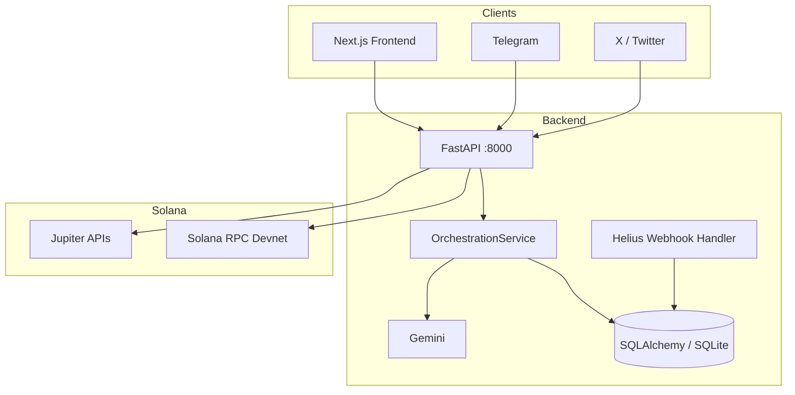

# XiaoLee Protocol

Assistente de IA multi-plataforma para Solana com backend FastAPI, integrações Telegram/X, Gemini para orquestração de intenção e fluxo wallet-first no frontend para swap na Devnet.

## Progresso de Construção

Status geral do projeto: **85% concluído**.

Leitura prática do estado atual: **MVP funcional com hardening de producao e readiness de mainnet em aberto**.

Ultima atualizacao documental: **2026-04-23**.

| Bloco | Status | Observação |
|---|---|---|
| Core API FastAPI | Concluído | Endpoints de health, inbound, webhooks e swap/prepare ativos |
| Integração Gemini | Concluído | Classificação de intenção + geração de resposta |
| Integrações Telegram/X | Concluído | Normalização de payload + validação de segredo/assinatura |
| Solana/Jupiter (prepare) | Concluído | Quote + transação unsigned para assinatura em wallet |
| Wallet-first frontend | Concluído | Connect, prepare, simulate, confirmação explícita, sign/send |
| QA frontend swap flow | Concluído | 13 testes cobrindo sucesso e principais falhas |
| QA backend MVP | Concluído | Suite principal passa com 34 testes e 8 skips legados |
| Observabilidade HTTP/Prometheus | Concluído | `/metrics` expõe contadores e latência média |
| CI/CD consolidado fullstack | Concluído | Workflow único cobre backend, frontend, lint, testes e build |
| Produção mainnet e auditoria | Pendente | Requer revisão de segurança e rollout controlado |

## Linha do Tempo de Construção

| Fase | Janela | Status | Entregas principais |
|---|---|---|---|
| Fase 1 | Concluida | Concluido | Base backend FastAPI, integracao Gemini, rotas de inbound |
| Fase 2 | Concluida | Concluido | Fluxo wallet-first no frontend com prepare/simulate/sign/send |
| Fase 3 | Concluida | Concluido | Hardening inicial de webhooks (Telegram/X/Helius) |
| Fase 4 | Concluida | Concluido | QA expandido, observabilidade HTTP e CI fullstack |
| Fase 5 | Pendente | Pendente | Readiness de mainnet e revisao final de seguranca |

## Rastreabilidade (Endpoint x Testes)

Resumo rapido de cobertura atual:

| Endpoint/Fluxo | Testes atuais |
|---|---|
| `POST /v1/messages/inbound` | `backend/tests/test_xiaolee_mvp_orchestration.py` |
| `POST /v1/integrations/telegram/webhook` | `backend/tests/test_xiaolee_mvp_security.py` |
| `POST /v1/integrations/x/webhook` | `backend/tests/test_xiaolee_mvp_security.py` |
| `POST /v1/solana/swap/prepare` | `backend/tests/test_xiaolee_mvp_security.py`, `frontend/src/components/navbar/Wallet.test.tsx` |
| `POST /v1/solana/webhooks/helius` | `backend/tests/test_helius_webhook.py` |
| `POST /v1/notifications/{notification_id}/ack` | `backend/tests/test_notifications_routes.py` |
| Fluxo de validacao/simulacao/envio na wallet | `frontend/src/components/navbar/Wallet.test.tsx` |
| Utilitarios de quote e amount conversion | `frontend/src/utils/swap.test.ts` |

## Arquitetura Resumida



## Quickstart

### Inicialização rápida

```bash
make init
```

Esse comando cria `.env` a partir de `.env.example` quando ele ainda não existir.
Tambem instala as dependencias do backend e do frontend automaticamente.
No backend, o bootstrap usa por padrao `backend/requirements.docker.txt` (mais estavel para setup local).
Se precisar instalar o conjunto completo legado, use:

```bash
make init-backend BACKEND_REQUIREMENTS=backend/requirements.txt
```

Para validar pré-requisitos locais manualmente:

```bash
make init-check
```

Para validar o ambiente após a inicialização com smoke tests rápidos:

```bash
make smoke
```

O smoke atual cobre um teste focal do backend (`tests/test_metrics.py`) e um teste utilitário do frontend (`src/utils/swap.test.ts`).

Para validar API real por HTTP (subindo backend temporariamente):

```bash
make smoke-api
```

Para rodar um preflight completo (toolchain + smoke + API smoke + lint rápido):

```bash
make preflight
```

Para espelhar localmente o workflow de CI fullstack (backend + frontend):

```bash
make ci-local
```

### Pré-requisitos

- Python 3.12+
- Node.js 18+
- Docker + Docker Compose

### Variáveis de ambiente

```bash
cp .env.example .env
```

Preencha no mínimo:

- `GEMINI_API_KEY` (recomendado para classificação real)
- `TELEGRAM_WEBHOOK_SECRET`
- `X_WEBHOOK_SECRET`
- `HELIUS_WEBHOOK_SECRET`
- `X_BEARER_TOKEN` e `X_DM_API_BASE_URL` se quiser envio de DM via X
- `CORS_ALLOWED_ORIGINS` se o frontend não estiver em `http://localhost:3000`

### Rodar local (sem Docker)

Backend:

```bash
cd backend
pip install -r requirements.txt
uvicorn server.app:app --host 0.0.0.0 --port 8000
```

Frontend:

```bash
cd frontend
npm install
npm run dev
```

### Rodar com Docker Compose

```bash
docker compose up --build
```

Serviços:

- Frontend: `http://localhost:3000`
- Backend: `http://localhost:8000`
- Docs OpenAPI: `http://localhost:8000/docs`
- Prometheus: `http://localhost:9090`

## Endpoints Principais

- `GET /health`
- `GET /status`
- `POST /chat`
- `POST /v1/messages/inbound`
- `POST /v1/integrations/telegram/webhook`
- `POST /v1/integrations/x/webhook`
- `POST /v1/solana/swap/prepare`
- `POST /v1/solana/webhooks/helius`
- `GET /campaigns`
- `POST /campaigns/join`
- `GET /v1/notifications/{twitter_user_id}`

## Qualidade e Testes

Frontend:

```bash
cd frontend
npm test
npm run lint -- --file src/components/navbar/Wallet.tsx
```

Backend:

```bash
cd backend
../.venv/bin/pytest -q
```

Observação: os scripts legados de Twikit e integrações externas ficam marcados como skip na coleta do pytest. Eles continuam disponíveis como scripts manuais quando as dependências opcionais estiverem instaladas.

## Segurança Implementada no MVP

- Validação de assinatura HMAC para webhook X.
- Validação de secret token para webhook Telegram.
- Rate limiting in-memory por plataforma/usuário.
- Fluxo wallet-first (sem custódia de chave privada no backend).
- Simulação antes do envio + confirmação manual explícita no frontend.

## Documentação

- [docs/ARCHITECTURE.md](docs/ARCHITECTURE.md): arquitetura atual e progresso por camada.
- [docs/API_REFERENCE.md](docs/API_REFERENCE.md): rotas, autenticação e payloads.
- [docs/SMART_CONTRACT.md](docs/SMART_CONTRACT.md): estado atual de integração on-chain.
- [docs/qa/QA_PLAN_XIAOLEE_MVP.md](docs/qa/QA_PLAN_XIAOLEE_MVP.md): cobertura de QA executada.
- [backend/memory-bank/progress.md](backend/memory-bank/progress.md): trilha de construção e próximos passos.
