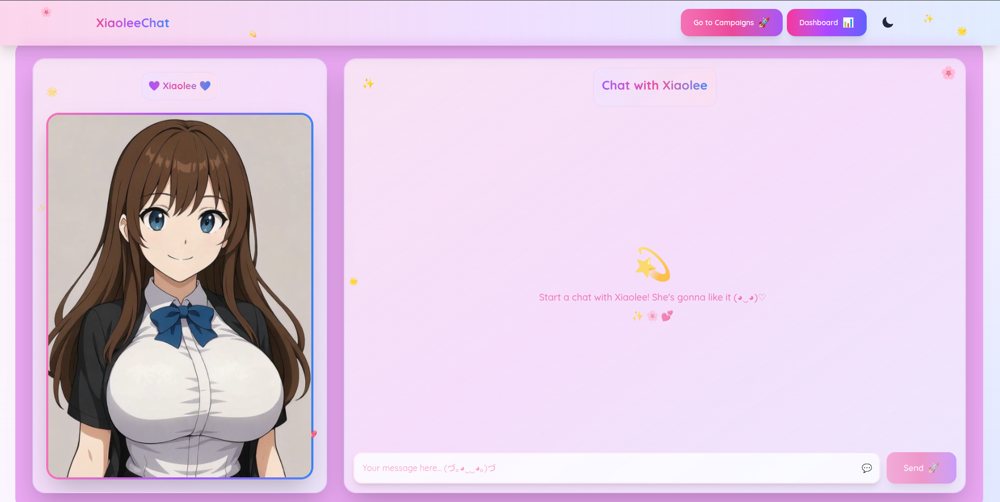
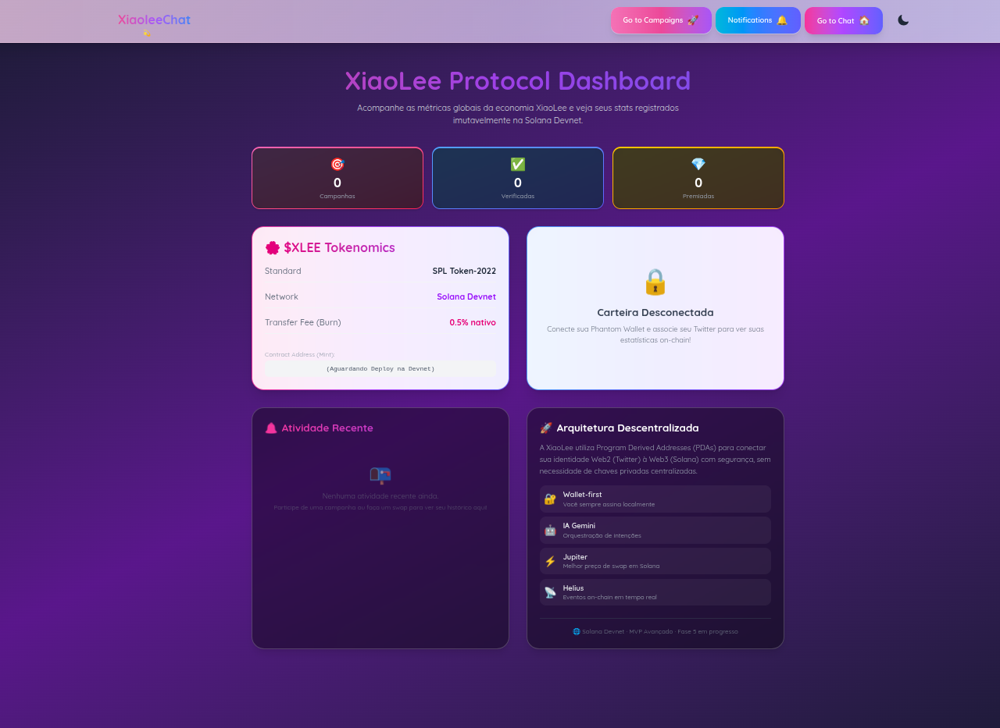
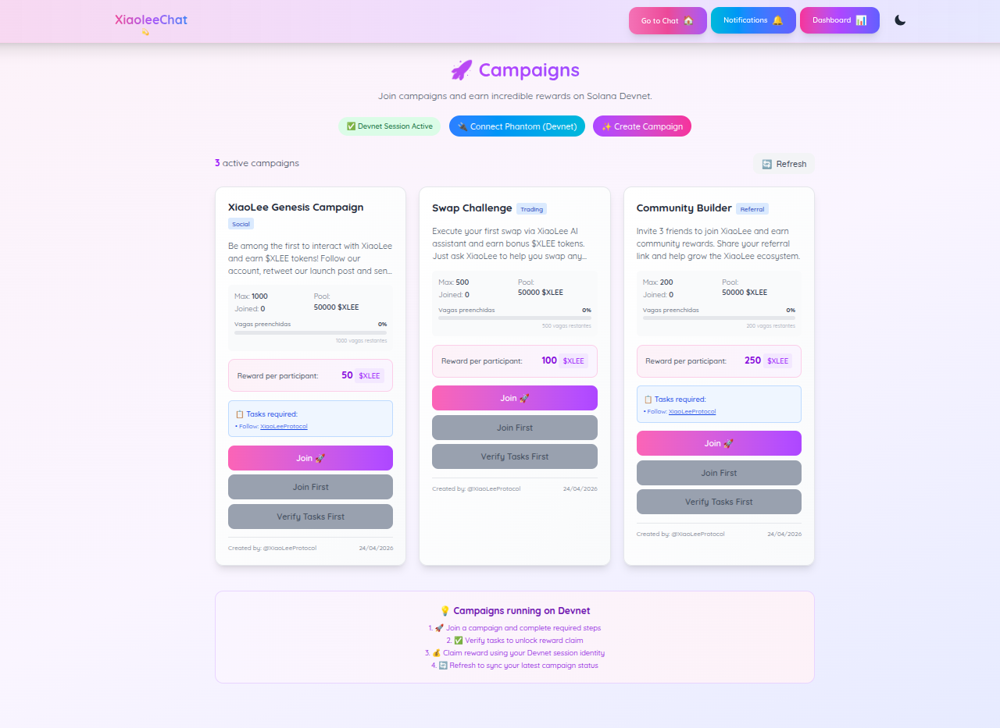
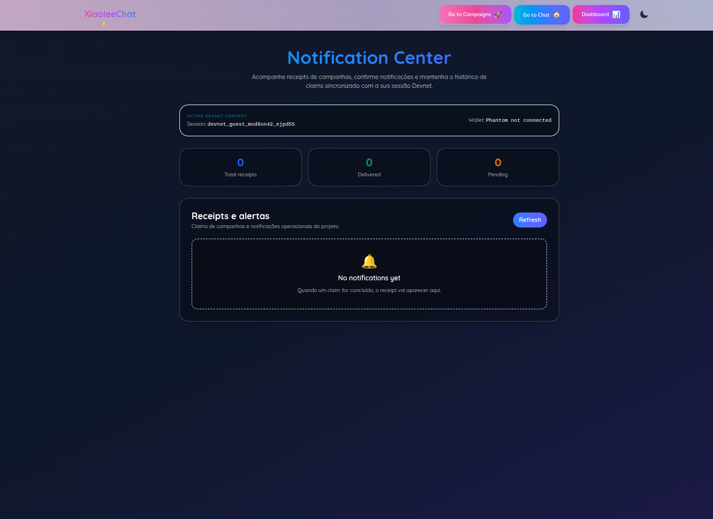
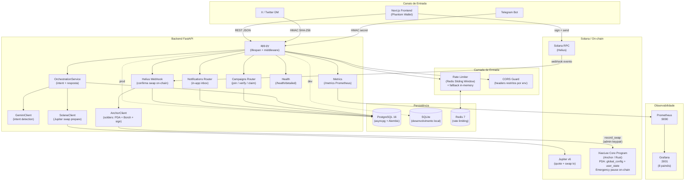
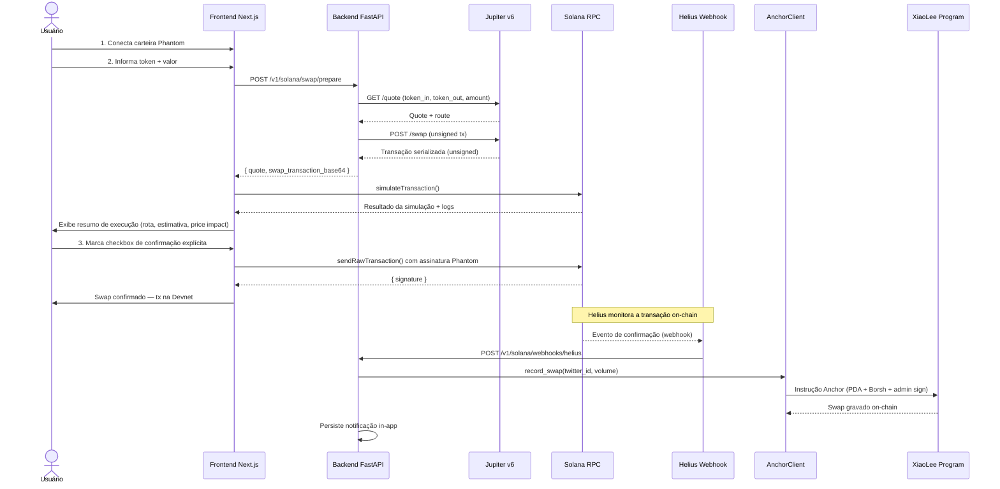
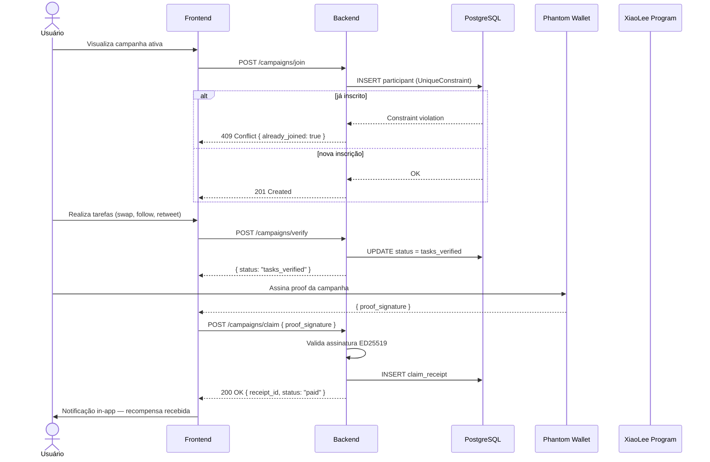

# XiaoLee Protocol

> Assistente de IA conversacional para Solana — swap wallet-first, campanhas DeFi on-chain, notificações in-app e interface bilíngue (EN/PT).
> **Atualizado: 2026-05-09 | Sprint 10 em andamento | Deploy Render + Railway configurado, CI verde**

---

## Interface Atual

| Chat | Dashboard | Campanhas | Notificações |
|---|---|---|---|
|  |  |  |  |

> Screenshots do design premium com paleta pink/fuchsia/purple unificada. Toggle EN/PT disponível na Navbar.

---

## Status do Projeto

Progresso: [##########] 98% — Código e UI completos. Deploy configurado (Railway + Render); pendente provisionamento dos serviços cloud.

| Bloco | Status | Detalhe |
|---|---|---|
| Core API FastAPI | [##########] 100% | `/health`, `/health/detailed`, `/status`, `/metrics`, `/chat`, `/v1/messages/inbound` |
| Integração Gemini | [##########] 100% | Intent detection + resposta contextual, personalidade bilíngue |
| Webhook Telegram | [##########] 100% | Secret token validado, bot operacional |
| Webhook X/Twitter (inbound) | [##########] 100% | HMAC SHA-256 validado, endpoint pronto para receber eventos |
| X/Twitter DM (outbound) | [####......] 40% | Código do poller pronto — **requer Twitter Developer App** (ver nota abaixo) |
| Solana/Jupiter (prepare) | [##########] 100% | Quote + tx unsigned para wallet assinar |
| Wallet-first frontend | [##########] 100% | Connect, prepare, simulate, confirmação explícita, sign/send |
| Campanhas Devnet | [##########] 100% | Join (409 idempotente), verify, claim com proof assinado |
| Redis Rate Limiting | [##########] 100% | Sliding window + fallback in-memory automático |
| PostgreSQL + Alembic | [########..] 80% | Migração gerada; provisionar DB em produção |
| Docker Compose completo | [##########] 100% | PostgreSQL + Redis + Grafana + migrate one-shot |
| Grafana Dashboard | [##########] 100% | 8 painéis, provisionamento automático |
| Anchor on-chain | [######....] 60% | PDA real (solders), record_swap (dry_run até keypair em produção) |
| Emergency Pause | [##########] 100% | `pause_protocol` / `unpause_protocol` no contrato Rust |
| UI/UX Premium | [##########] 100% | SVG icons inline, paleta unificada, responsividade mobile, contraste de texto corrigido |
| i18n EN/PT | [##########] 100% | `LanguageContext`, toggle na Navbar, todos os componentes traduzidos |
| QA backend | [##########] 100% | **65 testes passando**, CI GitHub verde |
| Deploy público (Render + Railway) | [######....] 60% | `railway.toml` + `render.yaml` prontos; provisionar serviços |
| Auditoria externa | [..........] 0% -- BLOQUEADOR MAINNET | Não iniciada — P0 para mainnet (não bloqueia demo) |

### Nota: X/Twitter DM

O canal X/Twitter tem **duas camadas** com status distintos:

- **Webhook inbound (100%)** — o endpoint `/v1/integrations/x/webhook` valida HMAC e processa eventos da API oficial. Pronto para receber mensagens assim que configurado no Twitter Developer Portal.
- **DM Poller outbound (bloqueado para hackathon)** — envio ativo de DMs pela XiaoLee exige acesso à [Twitter API v2 DM](https://developer.twitter.com/en/docs/twitter-api/direct-messages/introduction), disponível a partir do plano **Basic ($100/mês)**. A biblioteca `agent-twitter-client` (scraper não-oficial) não é mais viável porque o Twitter removeu o endpoint `guest/activate.json` em 2025.

**Decisão de produto:** o outbound DM via X faz sentido econômico apenas no lançamento em mainnet, quando o volume de usuários justifica o custo do Developer App. Para o hackathon e devnet, o **Telegram está 100% operacional** como canal de mensagens. O X é o canal alvo para mainnet.

---

## Arquitetura do Sistema

### Visão Geral dos Componentes



---

### Fluxo de Swap Wallet-first



---

### Fluxo de Campanha



---

### Fluxo de i18n (EN/PT)

```mermaid
graph LR
    LS["localStorage<br>xiaolee_lang"] -->|hidratação| LP["LanguageProvider<br>(React Context)"]
    LP -->|t(key)| C1["Navbar"]
    LP -->|t(key)| C2["Campaigns"]
    LP -->|t(key)| C3["Wallet Modal"]
    LP -->|t(key)| C4["Transações Modal"]
    LP -->|t(key)| C5["Dashboard"]
    LP -->|t(key)| C6["Notifications"]

    subgraph LOCALES["src/locales/"]
        EN["en.json"]
        PT["pt.json"]
    end

    LP -->|lang === 'en'| EN
    LP -->|lang === 'pt'| PT

    TOGGLE["LangToggle<br>(EN / PT pill)"] -->|setLang()| LP
```

---

## Quickstart

```bash
# 1. Setup completo (venv + npm + .env)
make init

# 2. Subir em modo dev
make dev

# 3. Verificar ambiente
make smoke
```

**OU com Docker (stack completa):**

```bash
cp .env.example .env  # preencha as variáveis
make run-docker
```

| Serviço | URL |
|---|---|
| Frontend | http://localhost:3000 |
| Backend | http://localhost:8000 |
| Docs Swagger | http://localhost:8000/docs |
| Grafana | http://localhost:3001 |
| Prometheus | http://localhost:9090 |

---

## Deploy (Render + Railway)

O stack de produção usa **Railway** para o backend FastAPI e **Render** para o frontend Next.js.

### Variáveis de ambiente — Frontend (Render)

| Variável | Valor |
|---|---|
| `NEXT_PUBLIC_CORE_API_URL` | URL pública do backend no Railway |

### Variáveis de ambiente — Backend (Railway)

| Variável | Descrição |
|---|---|
| `GEMINI_API_KEY` | Chave Google Gemini |
| `DATABASE_URL` | PostgreSQL (Railway provisiona automaticamente) |
| `REDIS_URL` | Redis (Railway provisiona automaticamente) |
| `TELEGRAM_WEBHOOK_SECRET` | Secret webhook Telegram |
| `X_WEBHOOK_SECRET` | HMAC webhook X/Twitter |
| `HELIUS_WEBHOOK_SECRET` | HMAC webhook Helius |
| `SOLANA_ADMIN_KEYPAIR_B58` | Admin keypair para record_swap (opcional — dry_run se ausente) |

### CORS

Após o deploy do frontend no Render, adicionar a URL ao `CORS_ALLOWED_ORIGINS` no Railway para liberar as chamadas do browser.

---

## Variáveis de Ambiente (local)

```bash
cp .env.example .env
```

| Variável | Descrição |
|---|---|
| `GEMINI_API_KEY` | Chave Google Gemini (classifica intenção) |
| `TELEGRAM_WEBHOOK_SECRET` | Secret para webhook Telegram |
| `X_WEBHOOK_SECRET` | HMAC para webhook X/Twitter |
| `HELIUS_WEBHOOK_SECRET` | HMAC para webhook Helius |
| `DATABASE_URL` | PostgreSQL em produção (vazio = SQLite) |
| `REDIS_URL` | Redis para rate limiting (vazio = in-memory) |
| `SOLANA_ADMIN_KEYPAIR_B58` | Admin keypair para `record_swap` (vazio = dry_run) |

---

## Testes

```bash
# Suíte backend completa (65 testes)
make test-backend

# Build frontend limpo
cd frontend && npm run build

# Testes de carga (20 users, 2 min)
make load-test-smoke

# Checklist de mainnet
make audit-checklist
```

---

## Banco de Dados

```bash
# Aplicar migrações (SQLite local ou PostgreSQL via DATABASE_URL)
make db-migrate

# Status das migrações
make db-status

# Nova migração após alterar models.py
make db-new-migration MSG="descricao"
```

---

## Smart Contract

| Item | Valor |
|---|---|
| Program ID | `Fmmpn79Tij8fzYHg31ekZz4MmK9ArGzN59VogfcwhXiM` |
| Cluster | Devnet |
| Instruções | `initialize_global`, `initialize_user`, `record_swap`, `pause_protocol`, `unpause_protocol`, `transfer_admin` |

```bash
make anchor-build
make anchor-deploy-devnet
make anchor-idl-sync
```

---

## Endpoints Principais

| Método | Endpoint | Descrição |
|---|---|---|
| `GET` | `/health` | Health check básico |
| `GET` | `/health/detailed` | Health com latência por dependência |
| `GET` | `/status` | Status resumido |
| `GET` | `/metrics` | Métricas Prometheus |
| `POST` | `/chat` | Chat com agente XiaoLee |
| `POST` | `/v1/messages/inbound` | Mensagem inbound (rate limited) |
| `POST` | `/v1/integrations/telegram/webhook` | Webhook Telegram |
| `POST` | `/v1/integrations/x/webhook` | Webhook X/Twitter (HMAC) |
| `POST` | `/v1/solana/swap/prepare` | Prepara swap (quote + tx unsigned) |
| `POST` | `/v1/solana/webhooks/helius` | Webhook Helius (confirma swap) |
| `GET` | `/campaigns` | Lista campanhas |
| `POST` | `/campaigns/join` | Entra em campanha (409 se já inscrito) |
| `POST` | `/campaigns/verify` | Verifica tarefas |
| `POST` | `/campaigns/claim` | Claim com proof assinado |
| `GET` | `/v1/notifications/me` | Notificações in-app |

> Documentação completa: [`docs/API_REFERENCE.md`](docs/API_REFERENCE.md)

---

## Segurança Implementada

- HMAC SHA-256 para webhooks X e Helius
- Secret token para webhook Telegram
- Rate limiting Redis (sliding window) com fallback in-memory
- CORS headers restritos via `CORS_ALLOWED_ORIGINS` env
- Fluxo não-custodial (chave do usuário nunca toca o backend)
- 409 Conflict idempotente (UniqueConstraint no banco)
- Emergency pause on-chain (`pause_protocol`)
- Container não-root no Dockerfile
- Suporte a secrets via vault (produção)

---

## Linha do Tempo

| Fase | Status | Entregas |
|---|---|---|
| Fase 1 | CONCLUÍDA | FastAPI, Gemini, inbound |
| Fase 2 | CONCLUÍDA | Wallet-first (prepare/simulate/sign/send) |
| Fase 3 | CONCLUÍDA | Webhooks hardening (Telegram/X/Helius) |
| Fase 4 | CONCLUÍDA | QA, observabilidade, CI fullstack |
| Fase 5 | CONCLUÍDA | Idempotência, Anchor client, CORS, 65 testes |
| Fase 6 | CONCLUÍDA | PostgreSQL, Redis, solders, Locust |
| Fase 7 | CONCLUÍDA | Docker completo, Grafana, Emergency pause |
| Fase 8 | CONCLUÍDA | Homologação E2E, testes de carga, UI Premium Refactor |
| Fase 9 | CONCLUÍDA | i18n EN/PT — LanguageContext, toggle navbar, todos os componentes traduzidos, correções de contraste e tamanho de texto |
| Fase 10 | EM ANDAMENTO | Deploy Render + Railway — configuração pronta (`railway.toml`, `render.yaml`), CI verde; provisionamento dos serviços em andamento |
| Fase 11 | PLANEJADA MAINNET | Twitter Developer App (Basic $100/mês) → ativar DM outbound; PostgreSQL prod, Redis prod, auditoria, multisig, mainnet beta |

---

## Documentação

| Arquivo | Conteúdo |
|---|---|
| [`docs/ARCHITECTURE.md`](docs/ARCHITECTURE.md) | Arquitetura completa, diagramas, fluxos |
| [`docs/DESIGN_SYSTEM.md`](docs/DESIGN_SYSTEM.md) | Paleta, ícones, i18n, padrão de cards e layout |
| [`docs/API_REFERENCE.md`](docs/API_REFERENCE.md) | Rotas, payloads, códigos de erro |
| [`docs/SMART_CONTRACT.md`](docs/SMART_CONTRACT.md) | Instruções on-chain, PDAs, eventos |
| [`docs/MAINNET_READINESS.md`](docs/MAINNET_READINESS.md) | Gates + checklist para mainnet |
| [`CONTRIBUTING.md`](CONTRIBUTING.md) | Setup, padrões, como contribuir |
| [`load_tests/README.md`](load_tests/README.md) | Instruções de teste de carga (Locust) |
| [`backend/memory-bank/progress.md`](backend/memory-bank/progress.md) | Trilha de construção detalhada |
