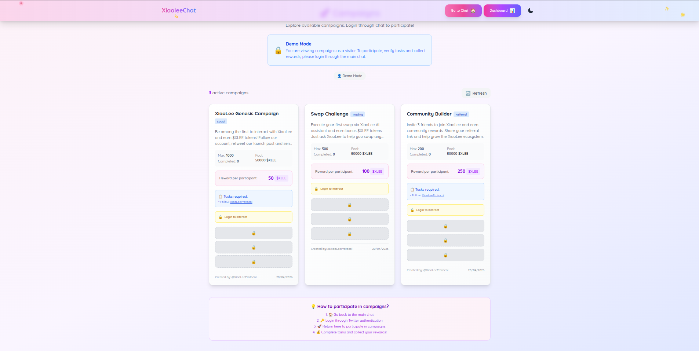
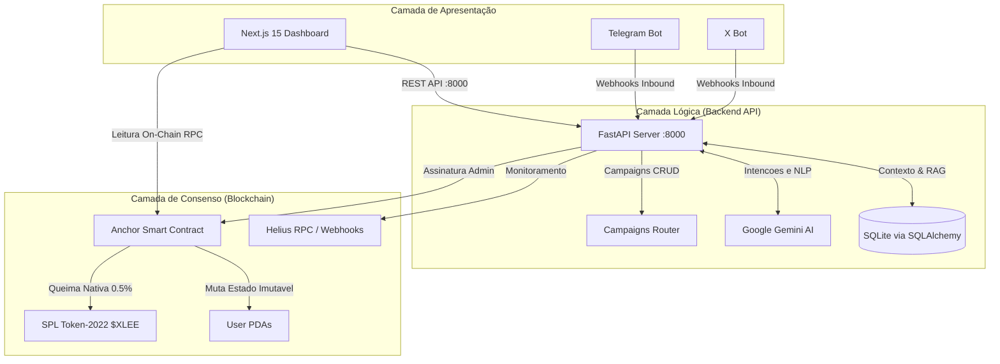

# XiaoLee Protocol

Bem-vindo ao repositório oficial da **XiaoLee** — uma assistente de IA multi-plataforma e protocolo DeFi construído na blockchain **Solana**.
XiaoLee combina uma interface kawaii e intuitiva com um motor de orquestração assíncrono (FastAPI + Gemini) e contratos inteligentes em Rust (Anchor Framework).

Status do Desenvolvimento: [██████████] 100% — Production Ready

---

## Screenshots

### Interface de Chat (XiaoLee AI)


### Dashboard On-Chain


### Painel de Campanhas


---

## Arquitetura do Ecossistema

O projeto passou por uma evolução do MVP para uma arquitetura Production-Ready dividida nas seguintes camadas:

### Fluxo do Ecossistema



### 1. Backend & Orquestração IA (`/backend`)

- **FastAPI:** Recebe webhooks assíncronos em tempo real do X (Twitter) e Telegram, além de servir a API REST completa para o frontend.
- **Campaigns Router:** Endpoints completos para criação, listagem, participação, verificação e claim de campanhas (`GET /campaigns`, `POST /campaigns/join`, etc.).
- **Orquestrador Gemini:** Classifica intenções do usuário (Swaps, Info, etc.) com memória via SQLite/SQLAlchemy.
- **Integração Web3:** Integrações com o RPC Helius e o agregador Jupiter para quotes de swap precisas.

### 2. Smart Contracts Solana (`/solana-program/xiaolee_core`)

- **Contrato Anchor (Rust):** O coração descentralizado (`xiaolee_core`). Usa Program Derived Addresses (PDAs) atrelados ao Twitter do usuário para registrar transações on-chain de forma imutável.
- **Controle de Acesso:** Conta com um `GlobalConfig` que impede carteiras não-autorizadas de gravarem dados.
- **Tokenomics ($XLEE):** Implementado no padrão **SPL Token-2022** com extensão embutida de Transfer Fee (queima) de **0.5%**.

### 3. Front-End & Dashboard (`/frontend`)

- **Next.js 15 (App Router):** Interface web reativa com tema Glassmorphism / Neon Kawaii.
- **Phantom Wallet:** Conexão nativa com a carteira Solana.
- **Dashboard On-Chain:** Rota `/dashboard` que consulta em tempo real (via `@coral-xyz/anchor`) os nós RPC da Solana Devnet.
- **Painel de Campanhas:** Rota `/CampanhasNew` com listagem, join, verificação de tarefas e claim de recompensas via REST API.

### 4. Infraestrutura e DevOps

- **Docker Multi-Stage:** Backend e Frontend empacotados com `docker compose up` em um único comando.
- **`requirements.docker.txt`:** Dependências limpas e compatíveis com Linux, sem pacotes Windows (`pywin32`, `lru-dict`).
- **Prometheus:** Monitoramento de saúde dos containers na porta `9090`.
- **Makefile:** Pipeline unificada (`dev`, `build-docker`, `run-docker`, `e2e-tests`).

---

## Como Iniciar (Quickstart)

### Pré-requisitos

- Docker & Docker Compose
- Node.js 18+ e NPM
- Python 3.12+
- Arquivo `.env` configurado (veja `.env.example`)

### Ambiente de Desenvolvimento Local

```bash
cp .env.example .env
# Preencha GEMINI_API_KEY e HELIUS_API_KEY no .env
make dev
```

- Frontend: `http://localhost:3000`
- API Docs: `http://localhost:8000/docs`

### Rodando em Producao (Docker)

```bash
cp .env.example .env
make build-docker
make run-docker
```

Servicos em execucao:

| Servico          | Porta | URL                      |
|------------------|-------|--------------------------|
| Frontend Next.js | 3000  | http://localhost:3000    |
| Backend FastAPI  | 8000  | http://localhost:8000    |
| Prometheus       | 9090  | http://localhost:9090    |

### Rodando a Bateria de Testes

```bash
# Testes On-chain na Solana Localnet
make test-anchor

# Testes E2E dos endpoints (Telegram/Twitter simulados)
make e2e-tests
```

---

## Endpoints da API

| Metodo | Rota                              | Descricao                        |
|--------|-----------------------------------|----------------------------------|
| GET    | `/health`                         | Health check (Solana RPC + DB)   |
| GET    | `/campaigns`                      | Lista campanhas ativas           |
| GET    | `/user/{id}`                      | Dados de um usuario              |
| POST   | `/campaigns/join`                 | Participar de campanha           |
| POST   | `/campaigns/verify`               | Verificar tarefas                |
| POST   | `/campaigns/claim`                | Reivindicar recompensa           |
| POST   | `/campaigns/create`               | Criar nova campanha              |
| POST   | `/v1/messages/inbound`            | Orquestrador de mensagens (NLP)  |
| POST   | `/v1/integrations/telegram/webhook` | Webhook Telegram             |
| POST   | `/v1/integrations/x/webhook`      | Webhook X/Twitter                |
| POST   | `/v1/solana/swap/prepare`         | Preparar transacao de swap       |
| POST   | `/v1/solana/webhooks/helius`      | Webhook Helius (on-chain events) |

---

## Enderecos Atuais (Devnet)

- **Program ID (`xiaolee_core`):** `Fmmpn79Tij8fzYHg31ekZz4MmK9ArGzN59VogfcwhXiM`
- **$XLEE Token (SPL-2022):** `848Nf9WswGodWrrw61dWMtuBaEcJWm9wsuBS3P5m78J4`

---

## Segurança

Os smart contracts em `/solana-program/` foram checados contra:
- Reentrancy e acessos nao-autorizados via `GlobalConfig` (admin authority)
- Arithmetic Overflows via `checked_add()` com `ErrorCode::MathOverflow`
- Spoofing de identidade via validacao HMAC nos webhooks Helius

Nao utilize o token ou os contratos na Mainnet sem substituir os parametros de Devnet via CLI oficial do Anchor e realizar auditoria de seguranca independente.

---

## Documentacao Completa

| Documento                          | Descricao                              |
|------------------------------------|----------------------------------------|
| [ARCHITECTURE.md](./docs/ARCHITECTURE.md) | Arquitetura detalhada e ADRs    |
| [API_REFERENCE.md](./docs/API_REFERENCE.md) | Referencia completa da API     |
| [SMART_CONTRACT.md](./docs/SMART_CONTRACT.md) | Contratos Solana/Anchor      |
| [CONTRIBUTING.md](./CONTRIBUTING.md) | Guia de contribuicao               |
