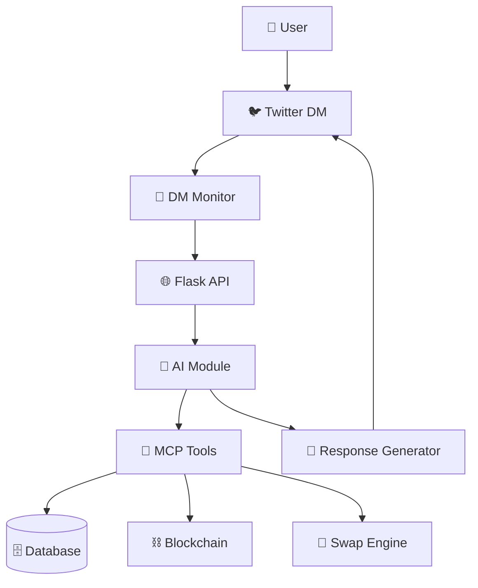
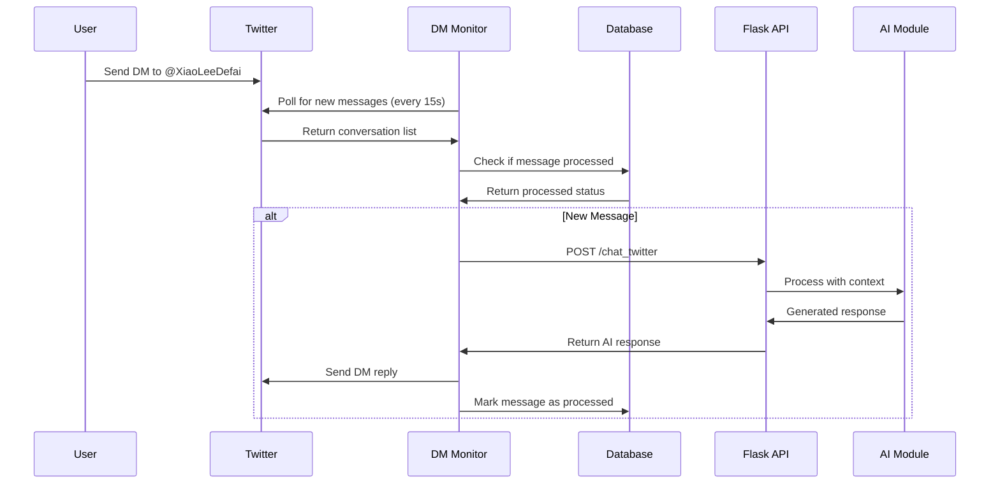
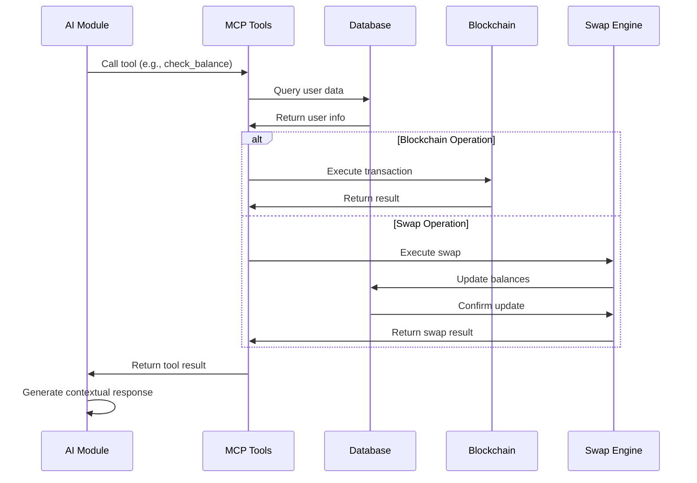
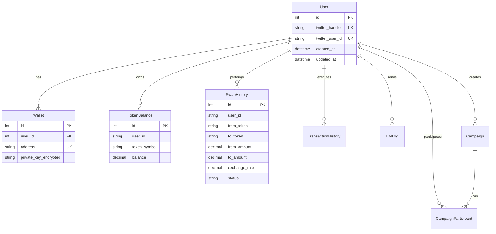

# Xiao Lee Project Architecture Documentation

## Table of Contents
- [Project Overview](#project-overview)
- [Architecture Overview](#architecture-overview)
- [Module Structure](#module-structure)
- [Data Flow](#data-flow)
- [Core Components](#core-components)
- [Database Schema](#database-schema)
- [API Endpoints](#api-endpoints)
- [Deployment & Configuration](#deployment--configuration)

## Project Overview

**Xiao Lee** is an AI-powered "Crypto Waifu" assistant that simplifies DeFi interactions through natural language conversations on Twitter DMs. Users can create wallets, check balances, perform token swaps, and manage digital assets without traditional UIs.

### Key Features
- 🤖 **Context-Aware AI Agent** with persistent user memory
- ⚡️ **Twitter DM Integration** for real-time communication
- ⛓️ **Full Wallet Functionality** (create, balance, swap, transfer)
- 🌸 **Waifu-Powered Personality** for engaging user experience
- ⚙️ **Modular & Scalable Architecture** for easy maintenance

## Architecture Overview



### System Flow
1. **User Input**: User sends DM to Xiao Lee on Twitter
2. **DM Monitoring**: Background service polls Twitter for new messages
3. **Message Processing**: Messages are filtered and processed for authentication/chat
4. **AI Processing**: LLM generates responses using available tools
5. **Tool Execution**: MCP tools perform blockchain operations
6. **Response Generation**: AI creates personalized responses
7. **Reply Delivery**: Response sent back via Twitter DM

## Module Structure

```
c:\Users\eu\Desktop\XiaoLee-1\
├── 🧠 ai/                          # AI & LLM Integration
│   ├── __init__.py                 # Module exports
│   ├── llm_client.py              # LLM provider interfaces (DeepSeek/OpenAI)
│   ├── mcp_tools.py               # MCP tools & blockchain operations
│   ├── prompts.py                 # Xiao Lee personality prompts
│   └── response_generator.py       # Complete response generation pipeline
├── ⛓️ blockchain/                   # Blockchain Infrastructure
│   ├── __init__.py
│   ├── monitor.py                 # Transaction monitoring
│   ├── story_client.py            # Story Protocol RPC client
│   ├── transaction_builder.py     # Transaction construction
│   └── wallet_manager.py          # Wallet creation & management
├── 🗄️ database/                    # Data Persistence Layer
│   ├── __init__.py
│   ├── base.py                    # SQLAlchemy base models
│   ├── database.py                # Database initialization
│   ├── init_db.py                 # Database setup utilities
│   └── models.py                  # All data models
├── 🌐 flask_api/                   # Web API Layer
│   ├── __init__.py
│   ├── chat_app.py                # Main Flask application
│   ├── chat_routes.py             # API endpoints & handlers
│   ├── cors_config.py             # CORS configuration
│   └── dm_listener.py             # Background DM processing service
├── 💱 swaps/                       # Trading Engine
│   ├── __init__.py
│   ├── balance_manager.py         # Internal balance management
│   ├── price_manager.py           # Token price feeds
│   └── swap_engine.py             # Swap execution logic
├── 👥 user_management/             # User Services
│   ├── __init__.py
│   ├── auth_service.py            # User authentication
│   ├── authentication_service.py  # Token-based auth
│   ├── campaign_service.py        # Marketing campaigns
│   ├── encryption_service.py      # Data encryption
│   ├── twitter_interaction_service.py # Twitter API integration
│   ├── user_manager.py            # Central user management
│   ├── user_service.py            # User operations
│   └── wallet_service.py          # Wallet-related services
├── 📜 scripts/                     # Utilities & Tools
├── 🧪 tests/                       # Test Suite
├── 📊 data/                        # Configuration & State Files
└── 📋 logs/                        # Application Logs
```

## Data Flow

### 1. Twitter DM Processing Flow



### 2. AI Tool Execution Flow



## Core Components

### 1. AI Module (`ai/`)

#### LLMClient (`llm_client.py`)
```python
class LLMClient:
    """Manages LLM provider interactions (DeepSeek/OpenAI)"""
    - generate_response(): Basic text generation
    - generate_response_with_tools(): Tool-enabled generation
    - continue_conversation_with_tool_results(): Multi-turn conversations
    - get_classification(): Message classification
```

#### MCPToolsManager (`mcp_tools.py`)
```python
class MCPToolsManager:
    """Manages MCP tools lifecycle and execution"""
    Tools Available:
    - create_wallet(): Generate new wallet
    - check_balance(): Get token balances
    - get_swap_quote(): Calculate swap rates
    - internal_swap(): Execute token swaps
    - withdraw_asset(): Transfer to external address
    - transfer_token(): Send to other users
    - play_animation(): Add visual responses
    - Campaign tools: create, join, verify campaigns
```

#### XiaoLeePrompts (`prompts.py`)
```python
class XiaoLeePrompts:
    """Defines Xiao Lee's personality and system prompts"""
    - get_base_system_prompt(): Core personality
    - get_tool_system_prompt(): Tool usage instructions
    - get_confirmation_prompt(): Action confirmations
    - Dynamic response prompts for various scenarios
```

#### XiaoLeeResponseGenerator (`response_generator.py`)
```python
class XiaoLeeResponseGenerator:
    """Complete response generation pipeline"""
    - generate_response(): Main entry point
    - _classify_user_intent(): Understand user needs
    - _execute_tools(): Handle tool calls
    - _generate_final_response(): Create contextual replies
```

### 2. Database Layer (`database/`)

#### Models (`models.py`)
Key entities and their relationships:

```python
# Core User System
User: twitter_handle, twitter_user_id
Wallet: user_id, address, private_key_encrypted
TokenBalance: user_id, token_symbol, balance

# Transaction System
SwapHistory: user_id, from_token, to_token, amounts, exchange_rate
TransactionHistory: user_id, type, token, amount, tx_hash, status
PendingTransfer: from_user, to_user, token, amount, status

# Communication System
DMLog: user_id, content, platform, twitter_message_id, session_id
ProcessedDM: twitter_message_id (prevents duplicate processing)

# Authentication System
AuthToken: token, twitter_user_id, status, expires_at
WebSession: session_id, twitter_user_id, expires_at

# Campaign System
Campaign: creator_id, name, type, reward_token, max_participants
CampaignParticipant: campaign_id, user_id, status, task_completion

# Price System
TokenPrice: symbol, name, price_usd, decimals, is_active
```

### 3. Blockchain Infrastructure (`blockchain/`)

#### StoryClient (`story_client.py`)
```python
class StoryClient:
    """Story Protocol RPC interface"""
    - connect(): Establish blockchain connection
    - get_balance(): Query wallet balances
    - send_transaction(): Submit signed transactions
    - get_transaction(): Query transaction status
    - estimate_gas(): Calculate gas costs
```

#### WalletManager (`wallet_manager.py`)
```python
class WalletManager:
    """Ethereum wallet operations"""
    - create_wallet(): Generate new key pair
    - sign_transaction(): Sign with private key
    - validate_address(): Check address format
```

#### TransactionBuilder (`transaction_builder.py`)
```python
class TransactionBuilder:
    """Transaction construction utilities"""
    - build_tx(): Create standard transfers
    - build_token_tx(): Create ERC-20 transfers
    - sign_and_send(): Complete transaction flow
```

### 4. Trading Engine (`swaps/`)

#### PriceManager (`price_manager.py`)
```python
class PriceManager:
    """Token price management"""
    - refresh(): Update prices from external API
    - get_price(): Get single token price
    - get_all(): Get all token prices
```

#### BalanceManager (`balance_manager.py`)
```python
class BalanceManager:
    """Internal balance management"""
    - get(): Query user balance
    - set(): Set balance amount
    - add(): Increase balance
    - subtract(): Decrease balance (with validation)
```

#### SwapEngine (`swap_engine.py`)
```python
class SwapEngine:
    """Swap execution logic"""
    - calculate(): Compute swap amounts
    - validate(): Check swap feasibility
    - execute_swap(): Perform the swap
    - history(): Get swap history
```

### 5. User Management (`user_management/`)

#### UserService (`user_service.py`)
```python
class UserService:
    """Core user operations"""
    - register(): Create new user
    - get_user_by_twitter_id(): Find user
    - get_user_dossier(): Complete user context
```

#### WalletService (`wallet_service.py`)
```python
class WalletService:
    """Wallet-related services"""
    - create_wallet_for_user(): Generate user wallet
    - get_wallet_balances(): Combined internal + blockchain
    - initialize_user_balances(): Setup starter tokens
```

#### AuthenticationService (`authentication_service.py`)
```python
class AuthenticationService:
    """Token-based authentication"""
    - generate_and_store_token(): Create 6-digit tokens
    - is_pending_token(): Check token status
    - activate_token(): Complete authentication
```

### 6. Flask API Layer (`flask_api/`)

#### ChatHandler (`chat_routes.py`)
```python
class ChatHandler:
    """API endpoint handlers"""
    Routes:
    - POST /chat: Direct chat interface
    - POST /chat_twitter: Twitter-specific chat
    - GET /health: Health check
    - GET /prices: Token prices
```

#### DMListenerService (`dm_listener.py`)
```python
class DMListenerService:
    """Background DM processing"""
    - start_monitoring(): Main polling loop
    - _poll_and_process_dms(): Fetch and process messages
    - _handle_chat_message(): Route to AI processing
    - _handle_token_activation(): Process auth tokens
```

## Database Schema

### Entity Relationship Diagram



## API Endpoints

### Chat API

#### `POST /chat`
Direct chat interface for testing and integration.

**Request:**
```json
{
    "message": "Check my balance",
    "user_id": "user_123"
}
```

**Response:**
```json
{
    "success": true,
    "message": "Here are your current balances:\n• WIP: 100.0\n• USDC.e: 50.0",
    "user_id": "user_123",
    "tools_used": ["check_balance"]
}
```

#### `POST /chat_twitter`
Twitter-specific chat processing with user registration.

**Request:**
```json
{
    "twitter_user_id": "1234567890",
    "message": "Swap 10 WIP to USDC.e"
}
```

**Response:**
```json
{
    "success": true,
    "message": "Successfully swapped 10.0 WIP for 5.2 USDC.e!\n• Exchange rate: 0.52\n• Your new balances:\n  - WIP: 90.0\n  - USDC.e: 55.2",
    "user_id": "1234567890",
    "tools_used": ["internal_swap", "check_balance"]
}
```

### Utility Endpoints

#### `GET /health`
Service health check.

#### `GET /prices`
Current token prices from PiperX API.

**Response:**
```json
{
    "success": true,
    "prices": {
        "WIP": 0.52,
        "USDC.e": 1.0,
        "ETH": 3500.0
    }
}
```

## Deployment & Configuration

### Entry Points

1. **Main Application (DM Monitor):**
   ```bash
   python dm_monitor.py
   ```
   - Monitors Twitter DMs
   - Processes messages in real-time
   - Integrates with Flask API

2. **Flask Chat API:**
   ```bash
   python -m flask_api.chat_app
   ```
   - Web API server on port 5000
   - Background DM listener service
   - Health checks and price endpoints

### Environment Configuration

Key environment variables in `.env`:

```env
# AI Configuration
DEEPSEEK_API_KEY=sk-xxxxx
AI_PROVIDER=deepseek

# Database
DATABASE_URL=sqlite+aiosqlite:///xiao_lee.db

# Twitter
TWITTER_USERNAME=XiaoLeeDefai
TWITTER_EMAIL=xiaoleedefai@gmail.com
TWITTER_PASSWORD=xxxxx

# Blockchain
STORY_RPC_URL=https://rpc.story.foundation
STORY_CHAIN_ID=1513

# Security
ENCRYPTION_KEY=xxxxx
```

### Database Initialization

```python
# Auto-creates tables on startup
async def create_db_and_tables(engine: AsyncEngine):
    async with engine.begin() as conn:
        await conn.run_sync(Base.metadata.create_all)
```

### Logging Configuration

```python
logging.basicConfig(
    level=logging.INFO,
    format='%(asctime)s - %(name)s - %(levelname)s - %(message)s',
    handlers=[
        logging.StreamHandler(),
        logging.FileHandler('logs/xiao_lee_bot.log', encoding='utf-8')
    ]
)
```

## Security Considerations

1. **Private Key Encryption**: Wallet private keys encrypted using PBKDF2
2. **Token Authentication**: 6-digit tokens with 10-minute expiry
3. **Input Validation**: All user inputs validated and sanitized
4. **Rate Limiting**: Built-in polling delays to prevent API abuse
5. **Error Handling**: Comprehensive exception handling prevents crashes

## Performance & Scalability

1. **Async Architecture**: Full async/await throughout the stack
2. **Connection Pooling**: SQLAlchemy async session management
3. **Batch Processing**: Message batching for improved efficiency
4. **Modular Design**: Easy to scale individual components
5. **Caching**: Price data cached and refreshed periodically

---

*This documentation covers the complete architecture of the Xiao Lee project as of the current implementation. For specific implementation details, refer to the individual module documentation and source code.*
