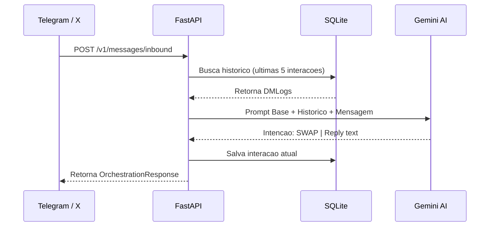
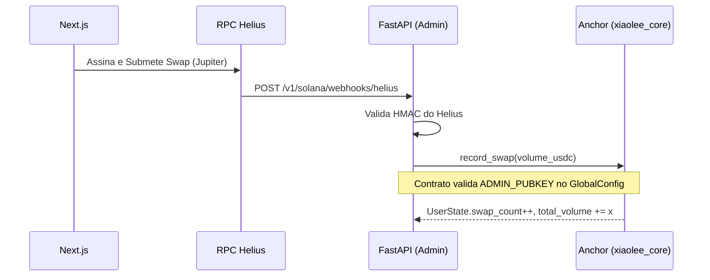
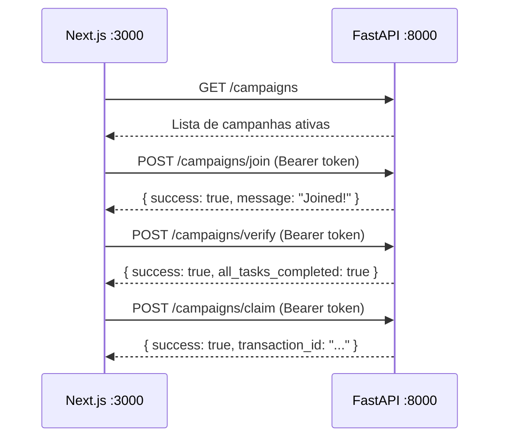

# Documentacao de Arquitetura da XiaoLee

Este documento fornece uma visao detalhada de como os subsistemas se comunicam, desde a interface de usuario ate o processamento de contratos inteligentes na Solana.

## Indice

- [Visao Geral](#visao-geral)
- [Stack Tecnologica](#stack-tecnologica)
- [Arquitetura de Alto Nivel](#arquitetura-de-alto-nivel)
- [Fluxo de Dados](#fluxo-de-dados)
- [Estrutura de Diretorios](#estrutura-de-diretorios)
- [Servicos Docker](#servicos-docker)
- [Decisoes de Design (ADRs)](#decisoes-de-design-adrs)

---

## Visao Geral

XiaoLee e um **protocolo DeFi automatizado** com interface interativa (Waifu/Kawaii).
O objetivo e reduzir a complexidade da Web3 abstraindo operacoes financeiras on-chain via conversas de chat (Telegram/X) e paineis simples no Next.js.

O principio de design **On-chain Minimo** garante que dados de alto volume (conversas) fiquem em banco de dados SQLite/Postgres, enquanto apenas dados de consenso financeiro (Volume, Swaps) vao para a Solana.

---

## Stack Tecnologica

| Camada        | Tecnologia                                          | Justificativa                                      |
|---------------|-----------------------------------------------------|----------------------------------------------------|
| Frontend      | Next.js 15, React 19, TailwindCSS, `@solana/web3.js`| SSR + App Router + suporte nativo a wallets Solana |
| Backend       | Python 3.12, FastAPI, SQLAlchemy, Uvicorn           | Alta performance assincrona, tipagem Pydantic      |
| IA            | Google Gemini (generativeai SDK)                    | Classificacao de intencoes e RAG contextual        |
| Blockchain    | Solana (Devnet/Mainnet), Rust, Anchor v0.30         | Baixo custo de gas, alta velocidade de transacao   |
| Token         | SPL Token-2022 com TransferFeeConfig                | Queima nativa de 0.5% sem contrato intermediario   |
| Infra         | Docker Compose, Prometheus                          | Orquestracao local e monitoramento de saude        |
| CI/CD         | GitHub Actions (`.github/`)                         | Pipeline automatizada de testes e deploy           |

---

## Arquitetura de Alto Nivel

O ecossistema e dividido em 3 camadas (Tiers) bem delimitadas:

```mermaid
graph TB
    subgraph "Camada de Apresentacao (Client)"
        UI[Next.js 15 :3000]
        Telegram[Telegram Bot]
        Twitter[X Bot]
    end

    subgraph "Camada Logica (Backend :8000)"
        FastAPI[FastAPI + Uvicorn]
        Gemini[Google Gemini AI]
        SQLite[(SQLite via SQLAlchemy)]
        CampaignsRouter[Campaigns Router]
        HealthRouter[Health & Status]
    end

    subgraph "Observabilidade"
        Prometheus[Prometheus :9090]
    end

    subgraph "Camada de Consenso (Blockchain)"
        Helius[Helius RPC / Webhooks]
        JupiterAgg[Jupiter Aggregator]
        Anchor[Anchor Program xiaolee_core]
        PDA[User PDAs]
        Token[SPL Token-2022 XLEE]
    end

    UI --> |REST API| FastAPI
    UI --> |RPC Direto| Helius
    Telegram --> |Webhooks| FastAPI
    Twitter --> |Webhooks| FastAPI

    FastAPI <--> |RAG + Contexto| SQLite
    FastAPI <--> |NLP + Intent| Gemini
    FastAPI --> |CRUD Campanhas| CampaignsRouter
    FastAPI --> |Health Check| HealthRouter

    FastAPI --> |Metricas| Prometheus

    FastAPI --> |Quotes de Swap| JupiterAgg
    FastAPI --> |Monitoramento Tx| Helius
    FastAPI --> |record_swap (Admin)| Anchor

    Anchor --> |Muta Estado| PDA
    Anchor --> |Fee 0.5%| Token
```

---

## Fluxo de Dados

### 1. Fluxo de Orquestracao (Mensagens de Chat)

Quando um usuario manda uma mensagem via Telegram ou X:



### 2. Fluxo de Registro On-Chain (Swap)



### 3. Fluxo de Campanhas



---

## Estrutura de Diretorios

```
/
├── backend/                        # Motor Python
│   ├── database/                   # SQLAlchemy (base.py, models, repository)
│   ├── server/                     # FastAPI (app.py, schemas, settings)
│   │   ├── campaigns_routes.py     # Router de campanhas e usuarios
│   │   ├── integrations/           # Adapters: Gemini, Solana, Telegram, X
│   │   ├── orchestration/          # Servico de orquestracao de intencoes
│   │   └── webhooks/               # Rotas Helius
│   ├── requirements.docker.txt     # Dependencias limpas para Linux/Docker
│   ├── requirements.txt            # Dependencias completas de dev
│   └── Dockerfile                  # Imagem multi-stage Python 3.12-slim
│
├── frontend/                       # DApp Next.js 15
│   ├── src/app/                    # App Router (layout, page)
│   ├── src/pages/                  # Pages Router (CampanhasNew, Home, Dashboard)
│   ├── src/components/             # UI (Navbar, Cards, UserData singleton)
│   │   └── campaigns/              # CampaignCard, CreateCampaignForm, etc.
│   ├── src/hooks/                  # Hooks (useCampaigns, useUserCampaigns, useChat)
│   ├── src/api/api.tsx             # Instancia Axios centralizada (baseURL :8000)
│   └── src/interfaces/             # Tipos TypeScript (Campaign, User, etc.)
│
├── solana-program/                 # Codigo On-Chain Rust
│   └── xiaolee_core/
│       ├── programs/               # Contrato Anchor (lib.rs)
│       ├── tests/                  # Testes TypeScript (ts-mocha)
│       └── scripts/                # Launch do Token-2022
│
├── ops/                            # Configuracoes de observabilidade
│   └── prometheus.yml              # Scrape config
│
├── qa/                             # Testes de qualidade
│   └── e2e_flow_simulation.py      # Simulacao de webhooks Telegram/X
│
├── .env.example                    # Template de variaveis de ambiente
├── docker-compose.yml              # Orquestracao: core + frontend + prometheus
└── Makefile                        # Pipeline unificada
```

---

## Servicos Docker

```yaml
# docker-compose.yml (resumo)
services:
  xiaolee-core:      # FastAPI  — porta 8000
  xiaolee-frontend:  # Next.js  — porta 3000
  prometheus:        # Metricas — porta 9090
```

Comandos:

```bash
make build-docker   # docker compose build
make run-docker     # docker compose up -d
make stop-docker    # docker compose down
```

---

## Decisoes de Design (ADRs)

### ADR-001: SPL Token-2022 com TransferFeeConfig

- **Contexto:** Precisavamos de um mecanismo deflacionario sustentavel.
- **Decisao:** Padrao Token-2022 com extensao `TransferFeeConfig` (0.5% tax).
- **Consequencia:** A queima de tokens e automatica por design da Solana, sem contratos intermediarios caros.

### ADR-002: PDAs para Volume de Swap

- **Contexto:** Queriamos ranquear usuarios baseados em uso (airdrops futuros).
- **Decisao:** `swap_count` e `total_volume` em contas PDA com seed `[b"user", twitter_id]`.
- **Consequencia:** Imutabilidade e transparencia absolutas. Qualquer integrador pode auditar o leaderboard via RPC sem confiar no banco Python.

### ADR-003: Admin Authority no Smart Contract

- **Contexto:** Vulnerabilidades de manipulacao de estados sao comuns no Web3.
- **Decisao:** Apenas o backend (que assina os webhooks Helius) detem a Private Key que corresponde ao `ADMIN_PUBKEY` armazenado no `GlobalConfig`.
- **Consequencia:** Hackers nao podem injetar volumes falsos chamando os contratos diretamente via RPC.

### ADR-004: requirements.docker.txt Separado

- **Contexto:** O `requirements.txt` gerado no Windows continha `pywin32` e `lru-dict` incompativeis com Linux.
- **Decisao:** Criar `requirements.docker.txt` com apenas as dependencias reais do FastAPI, limpas e multiplataforma.
- **Consequencia:** Build Docker estavel em qualquer SO sem necessidade de filtros condicionais no Dockerfile.

### ADR-005: In-Memory Store para Campanhas (MVP)

- **Contexto:** Campanhas precisavam de um backend funcional rapidamente sem setup de banco complexo.
- **Decisao:** Dicionarios Python em memoria com tipos Pydantic espelhando exatamente a interface TypeScript `Campaign`.
- **Consequencia:** Dados nao sao persistidos entre restarts do container. Migracao para PostgreSQL/SQLite e o proximo passo para producao real.
