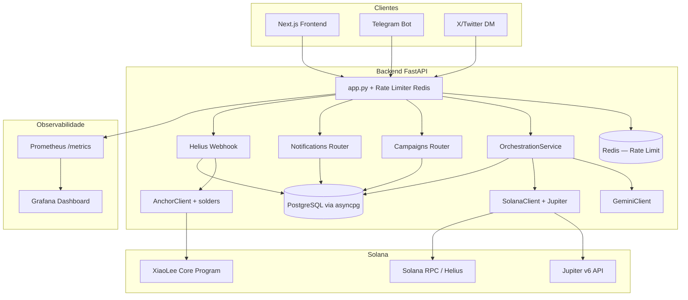

# Arquitetura XiaoLee — Estado Atual

> Atualizado em: **2026-05-09** | Sprint 9 — i18n EN/PT concluída.
> Estimativa geral de construção: **98%** (faixa estimada: **97% a 99%**).
> O que falta é exclusivamente **infraestrutura de produção e auditoria externa** — não código.

---

## 1. Visão Geral

XiaoLee é um protocolo DeFi conversacional que combina:

- **Backend FastAPI** — orquestração de mensagens, rate limiting (Redis), campanhas e integrações.
- **Gemini AI** — classificação de intenção e resposta contextual.
- **Solana Devnet + Jupiter** — fluxo de swap wallet-first (não-custodial).
- **Anchor (XiaoLee Core)** — registro on-chain de swaps, PDAs de usuário, emergency pause.
- **Frontend Next.js** — conexão Phantom, prepare/simulate/sign/send, campanhas, dashboard.

**Princípio central:** wallet-first e não-custodial. O backend prepara e orquestra; a assinatura sempre fica com o usuário.

---

## 2. Progresso por Camada

| Camada | Status | Entregas |
|---|---|---|
| Backend Core (FastAPI) | [##########] 100% | `/health`, `/health/detailed`, `/status`, `/chat`, `/metrics`, `/v1/messages/inbound` |
| Webhook Telegram | [##########] 100% | Secret token validado, bot operacional |
| Webhook X/Twitter (inbound) | [##########] 100% | HMAC SHA-256 validado, endpoint pronto |
| X/Twitter DM outbound | [####......] 40% | Poller implementado — requer Twitter Developer App para ativar em produção |
| Helius Webhook | [##########] 100% | HMAC validado, best-effort record_swap |
| IA (Gemini) | [##########] 100% | Intent detection + resposta contextual |
| Swap Prepare (Jupiter) | [##########] 100% | Quote + tx unsigned para assinatura em wallet |
| Wallet Execution (Frontend) | [##########] 100% | Connect, prepare, simulate, confirmação explícita, sign/send |
| UI/UX e Responsividade | [##########] 100% | Otimização mobile (`100dvh`, teclado virtual, drag/drop PFP); redesign premium Dashboard e Notifications (SVG icons, paleta unificada, zero emojis de layout); correções de contraste de texto |
| Campanhas | [##########] 100% | Join (409 idempotente), verify, claim com proof assinado, receipt persistido |
| Redis Rate Limiting | [##########] 100% | Sliding window + fallback in-memory automático |
| PostgreSQL + Alembic | [########..] 80% | Migração gerada; requer provisionamento em produção |
| Docker Compose | [##########] 100% | PostgreSQL + Redis + Grafana + migrate one-shot |
| Observabilidade | [##########] 100% | `/metrics` Prometheus, Grafana 8 painéis, `/health/detailed` |
| Anchor on-chain | [######....] 60% | AnchorClient com PDA real (solders), record_swap (dry_run até keypair em produção) |
| Emergency Pause | [##########] 100% | `pause_protocol` / `unpause_protocol` / `transfer_admin` no contrato |
| Testes de carga | [######....] 60% | Locust 3 cenários; executar em staging |
| QA suite | [##########] 100% | **65 testes passando**, 6 skips legados |
| Auditoria externa | [..........] 0% -- BLOQUEADOR | Não iniciada — bloqueia mainnet |

### Evolução por Sprint

| Sprint | Status | Entregas Principais |
|---|---|---|
| Fase 1 | Concluida | Base FastAPI, Gemini, rotas de inbound |
| Fase 2 | Concluida | Fluxo wallet-first (prepare/simulate/sign/send) |
| Fase 3 | Concluida | Hardening de webhooks (Telegram/X/Helius) |
| Fase 4 | Concluida | QA expandido, observabilidade HTTP, CI fullstack |
| Fase 5 | Concluida | Idempotência 409, Anchor Client, CORS hardening, 65 testes |
| Fase 6 | Concluida | PostgreSQL/Alembic, Redis Rate Limit, solders PDA, Locust |
| Fase 7 | Concluida | Docker Compose completo, Grafana, Emergency Pause Rust, Makefile, UI Mobile hardening |
| Fase 8 | Concluida | UI Premium Refactor: Dashboard e Notifications redesenhados (SVG icons inline, paleta unificada, responsividade mobile, Navbar com ícones premium) |
| Fase 9 | Concluida | i18n EN/PT: `LanguageContext`, `useLanguage()`, `t()` com dot-path + interpolação `{{var}}`, toggle EN/PT na Navbar, locale files `en.json`/`pt.json`, todos os componentes traduzidos, correções de contraste e tamanho de texto |
| Fase 10 | Planejada | Provisionar infra produção, Auditoria, HTTPS, Multisig, Mainnet beta |

---

## 3. Arquitetura de Alto Nível



---

## 4. Fluxos Críticos

### 4.1 Inbound IA

1. Mensagem entra por `/v1/messages/inbound` (ou webhook Telegram/X).
2. Rate limiter (Redis sliding window) verifica limite por chave.
3. Backend valida segredo/HMAC e orquestra intent via Gemini.
4. Resposta persistida e entregue no canal de origem.

**Canais de entrada:**

| Canal | Status | Observação |
|---|---|---|
| Frontend Next.js | Operacional | REST direto |
| Telegram Bot | Operacional | Secret token validado |
| X/Twitter (inbound webhook) | Pronto | HMAC SHA-256; requer configuração no Twitter Developer Portal |
| X/Twitter (DM outbound) | Planejado — mainnet | Requer Twitter Developer App Basic ($100/mês); biblioteca unofficial não-viável desde 2025 |

### 4.2 Swap Wallet-first

1. Frontend chama `/v1/solana/swap/prepare` — quote + tx unsigned.
2. Frontend simula na Devnet e exige confirmação explícita do usuário.
3. Wallet Phantom assina e envia para o RPC Solana.
4. Helius webhook notifica o backend após confirmação.
5. Backend chama `record_swap` via `AnchorClient` (best-effort, dry_run até keypair configurada).

### 4.3 Campanhas

1. Usuário chama `POST /campaigns/join` — `UniqueConstraint` garante idempotência (409 Conflict se já inscrito).
2. `POST /campaigns/verify` — verifica tarefas e emite `campaign:tasks_verified`.
3. `POST /campaigns/claim` — valida proof assinado pela wallet, persiste receipt, cria notificação in-app.

### 4.4 Observabilidade

1. Cada request HTTP é registrado em `xiaolee_http_requests_total` e `xiaolee_http_request_duration_seconds_avg`.
2. `GET /metrics` expõe métricas em formato Prometheus.
3. Grafana consome via datasource provisionado automaticamente.
4. `GET /health/detailed` verifica DB, Solana RPC, Gemini e Jupiter com latência por dependência.

---

## 5. Segurança Implementada

| Mecanismo | Status |
|---|---|
| HMAC para webhook X | OK |
| Secret token webhook Telegram | OK |
| Secret HMAC webhook Helius | OK |
| Rate limit por usuário/plataforma (Redis) | OK |
| CORS headers restritos (`CORS_ALLOWED_HEADERS` env) | OK |
| Fluxo não-custodial (sem chave privada do usuário no backend) | OK |
| Simulação + confirmação manual antes do envio | OK |
| 409 Conflict idempotente (UniqueConstraint DB) | OK |
| Emergency pause on-chain (`pause_protocol`) | OK |
| Admin keypair via env / vault (não hardcoded) | OK |
| PostgreSQL connection pool com `pool_pre_ping` | OK |
| Container não-root (Dockerfile) | OK |
| Auditoria externa | Pendente Pendente |
| HTTPS + HSTS em produção | Pendente Pendente |
| Multisig Gnosis Safe como admin | Pendente Pendente |
| Secrets via vault (não .env simples) | Pendente Pendente |

---

## 6. Estrutura de Diretórios (relevante)

```text
XiaoLee/
├── backend/
│ ├── alembic/ # Migrações de schema (Alembic async)
│ ├── database/
│ │ ├── database.py # Suporte dual SQLite/PostgreSQL
│ │ └── models.py
│ ├── server/
│ │ ├── app.py # FastAPI + lifespan + CORS + rate limiter
│ │ ├── rate_limiter.py # Redis sliding window + fallback in-memory
│ │ ├── settings.py # Env vars (DATABASE_URL, REDIS_URL, ...)
│ │ ├── metrics.py # Contadores Prometheus
│ │ ├── campaigns_routes.py
│ │ ├── notifications_routes.py
│ │ ├── webhooks/
│ │ │ └── helius_routes.py # record_swap best-effort
│ │ └── integrations/
│ │ └── anchor_client.py # PDA derivation + solders + submit
│ └── tests/ # 65 testes passando
├── frontend/
│ ├── src/
│ │ ├── components/ # Wallet, CampaignCard, Dashboard
│ │ ├── hooks/ # useJoinCampaign (409 tratado)
│ │ └── idl/ # xiaolee_core.json (IDL real)
├── solana-program/
│ └── xiaolee_core/
│ └── src/lib.rs # Program + emergency pause + events
├── load_tests/
│ └── locustfile.py # 3 cenários (Critical, ReadOnly, Chat)
├── ops/
│ ├── prometheus.yml
│ └── grafana/ # Dashboard provisionado automaticamente
├── docs/
│ ├── API_REFERENCE.md
│ ├── ARCHITECTURE.md # Este arquivo
│ ├── DESIGN_SYSTEM.md # Paleta, ícones, padrão de cards e layout
│ ├── SMART_CONTRACT.md
│ └── MAINNET_READINESS.md # 6 gates com checklist
├── docker-compose.yml # PostgreSQL + Redis + Grafana + migrate
├── .env.example # Template completo de variáveis
└── Makefile # db-migrate, load-test, anchor-build, ...
```

---

## 7. Próximos Passos

### Fase 10 — Deploy Hackathon (em andamento)

1. **Provisionar Railway** — conectar repo, adicionar PostgreSQL + Redis, configurar env vars.
2. **Provisionar Render** — static site com `rootDir: frontend`, `out/` como publish path.
3. **Atualizar CORS** — após URL do Render, adicionar em `CORS_ALLOWED_ORIGINS` no Railway.

### Fase 11 — Mainnet

1. **Twitter Developer App Basic ($100/mês)** — ativar DM outbound da XiaoLee via API oficial v2. O webhook inbound (`/v1/integrations/x/webhook`) já está pronto; só falta o token de acesso com permissão de DM.
2. **Provisionar PostgreSQL 16+** e rodar `make db-migrate`.
3. **Configurar `SOLANA_ADMIN_KEYPAIR_B58`** no vault → testar `record_swap` submit real em devnet.
4. **HTTPS + HSTS** no servidor de produção.
5. **Contratar auditores** — mínimo 2 firmas independentes (ver `docs/MAINNET_READINESS.md`).
6. **Multisig Gnosis Safe** como admin do protocolo (substituir EOA).
7. **`make load-test-staging`** — validar p95 < 500ms.
8. **Mainnet beta** com TVL limitado + bug bounty ativo.

---

## 8. Notas Operacionais

### CI/CD

GitHub Actions (`fullstack-ci.yml`) roda em todo push para `main`:
- **Backend:** `pytest -q --ignore=tests/test_anchor_integration.py` (65 testes, ignora teste de integração Anchor que requer validador local)
- **Frontend:** `npm run lint` + `npm run build`

### X/Twitter DM — Decisão de Arquitetura

O poller de DMs (`backend/server/integrations/x_poller.py`) está implementado e suporta três modos de auth (login, env cookies, arquivo de cookies). Está desativado em produção por enquanto porque:

1. A biblioteca `agent-twitter-client` (não-oficial) parou de funcionar em 2025 — o Twitter removeu `guest/activate.json` da v1.1 API.
2. A API oficial v2 com permissão de DM requer o plano **Basic ($100/mês)** no Twitter Developer Portal.
3. Para hackathon/devnet, o **Telegram é o canal principal** e cobre 100% do fluxo conversacional.

A ativação do X DM outbound é o primeiro passo da Fase 11 (mainnet), quando o volume de usuários justifica o custo.

### Testes Legados

Scripts de integração com Twikit e ferramentas de suporte antigas foram mantidos como referência. Estão skipados no pytest para não quebrar a suíte principal. A suíte ativa é de **65 testes passando**.
