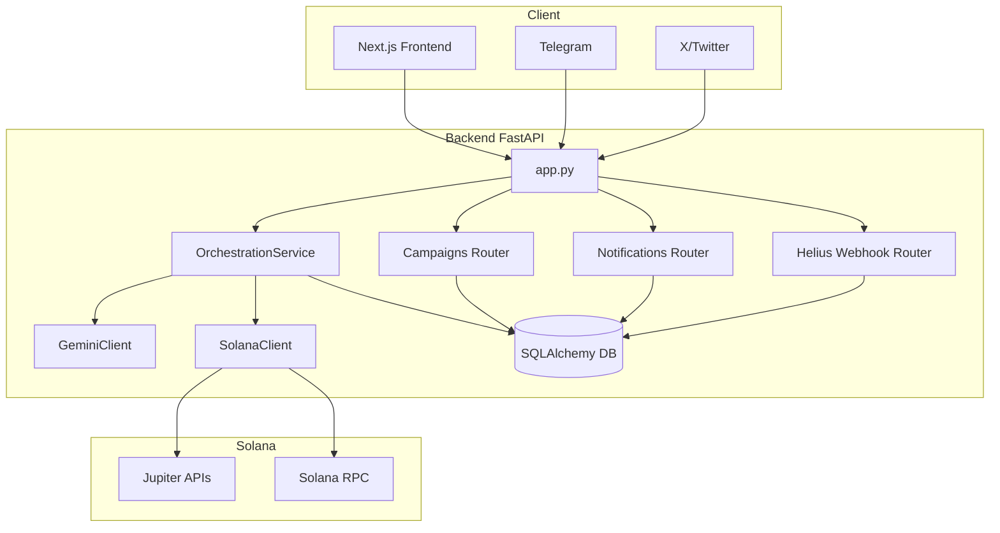

# Arquitetura XiaoLee (Estado Atual)

Este documento descreve a arquitetura implementada hoje no repositório e o progresso de construção por camada.

Estimativa geral de construção: **85%**.

Atualizacao documental: **2026-04-23**.

## 1. Visão Geral

XiaoLee combina:

- Backend FastAPI para orquestração de mensagens e integrações.
- Gemini para classificação de intenção e resposta contextual.
- Solana Devnet + Jupiter para fluxo de swap wallet-first.
- Frontend Next.js com conexão Phantom e envio explícito após simulação.

Princípio atual: **wallet-first e não-custodial no frontend**. O backend prepara a transação, mas assinatura/envio dependem do usuário na wallet.

## 2. Progresso de Construção (Arquitetura)

Data de referencia: **2026-04-23**.

| Camada | Status | Entregas |
|---|---|---|
| Backend Core | Concluído | `/health`, `/status`, `/chat`, `/v1/messages/inbound` |
| Integrações de Canal | Concluído | Webhooks Telegram/X com validação de segurança |
| IA (Gemini) | Concluído | Intent detection + geração de resposta |
| Swap Prepare (Jupiter) | Concluído | `/v1/solana/swap/prepare` com payload unsigned |
| Wallet Execution (Frontend) | Concluído | Connect, prepare, simulate, confirmação, sign/send |
| Campanhas e Notificações | Concluído (MVP) | Rotas de campanhas e inbox de notificações |
| On-chain enrichment (Anchor main flow) | Parcial | Estruturas existem, integração de produção pendente |
| Observabilidade avançada | Concluído | Health + `/metrics` com contadores e latência média |
| QA principal | Concluído | Backend: 34 passed, 8 skipped legados; Frontend: 13 passed |

### Evolucao por Fase

| Fase | Estado |
|---|---|
| Fundacao Backend + IA | Concluida |
| Entrega do fluxo wallet-first | Concluida |
| Segurança de webhooks e rate-limit | Concluida |
| Cobertura QA e rastreabilidade | Concluida |
| Rollout readiness (mainnet gate) | Pendente |

## 3. Arquitetura de Alto Nível



## 4. Fluxos Críticos

### 4.1 Inbound IA

1. Mensagem entra por `/v1/messages/inbound` (ou por webhook Telegram/X).
2. Backend aplica rate limit e valida segredo/assinatura quando aplicável.
3. Orquestrador consulta histórico e executa intent.
4. Backend persiste logs e devolve resposta estruturada.

### 4.2 Swap Wallet-first

1. Frontend envia request para `/v1/solana/swap/prepare`.
2. Backend consulta quote e cria transação unsigned via Jupiter.
3. Frontend simula na Devnet.
4. Usuário confirma explicitamente.
5. Wallet assina e frontend envia para RPC.

### 4.3 Webhook Helius e Notificações

3. Helius envia evento para `/v1/solana/webhooks/helius`.
2. Backend valida segredo, processa evento e atualiza histórico.
3. Notificação pode ser entregue em-app, Telegram e X.

### 4.4 Observabilidade e Métricas

1. Cada request HTTP é contabilizado por método, rota e status.
2. `/metrics` expõe texto compatível com Prometheus.
3. Latência média por rota fica disponível para inspeção operacional rápida.

## 5. Segurança Implementada

- HMAC para webhook X.
- Secret token para webhook Telegram.
- Secret para webhook Helius.
- Rate limit por usuário/plataforma.
- Fluxo não-custodial (sem chave privada do usuário no backend).
- Simulação antes de envio e confirmação manual no frontend.

## 6. Estrutura de Diretórios (relevante)

```text
backend/
  server/
    app.py
    campaigns_routes.py
    notifications_routes.py
    webhooks/helius_routes.py
    integrations/
    orchestration/
frontend/
  src/components/navbar/Wallet.tsx
  src/components/navbar/Wallet.test.tsx
  src/utils/swap.ts
  src/utils/swap.test.ts
docs/
  ARCHITECTURE.md
  API_REFERENCE.md
  SMART_CONTRACT.md
  qa/QA_PLAN_XIAOLEE_MVP.md
```

## 7. Próximos Passos de Arquitetura

1. Fechar o checklist de rollout mainnet e revisao formal de seguranca.
2. Definir o caminho de integracao Anchor no fluxo de producao.
3. Ampliar a observabilidade se surgirem novos pontos cegos operacionais.
4. Manter a suite principal e o workflow fullstack como gates de regressao.

## 8. Nota Sobre Testes Legados

Os arquivos de integração Twikit e scripts de suporte antigos foram mantidos apenas como referência operacional. Eles estão skipados na coleta padrão do pytest para não quebrar a suíte principal quando dependências opcionais não estão instaladas.
